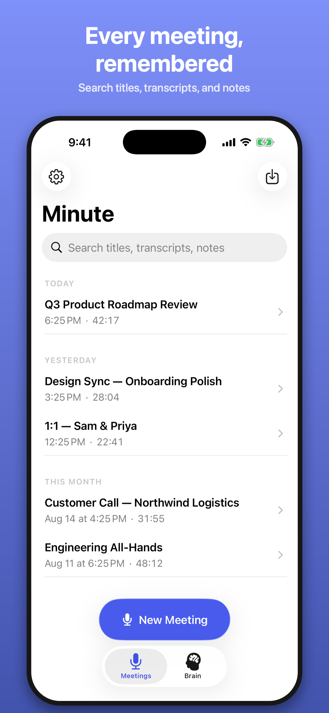
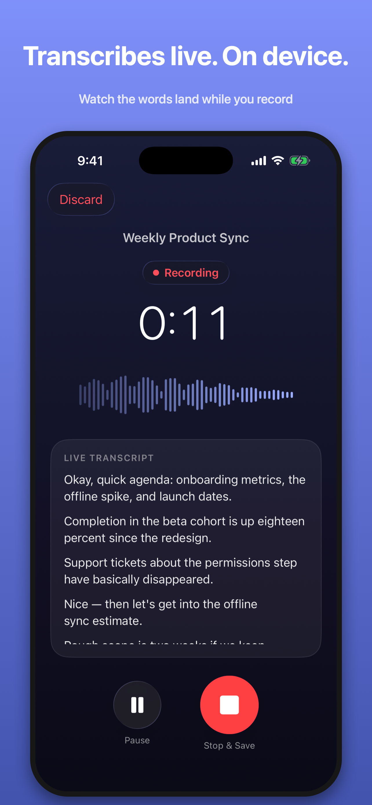
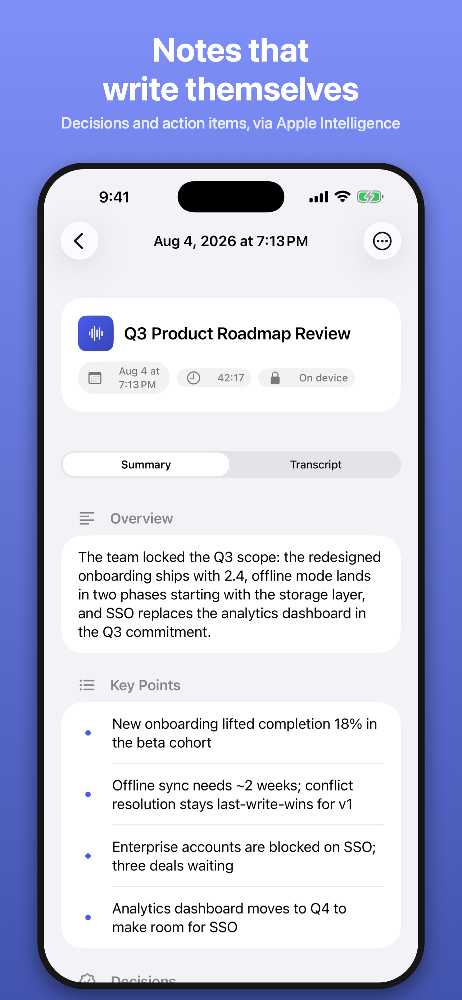

# Minute

**Privacy-first meeting notes for iPhone. Process every meeting entirely on your device.**


Minute records in-person meetings, produces a live transcript with Apple's on-device speech models, and generates structured notes with the on-device Apple Intelligence model. **Recordings, transcripts, and summaries stay on your iPhone by default**; meeting-content copies are created only through the backup or sharing options you choose. There is no account, backend, analytics, or tracking.

| Meeting library | Recording | Meeting notes |
|:---:|:---:|:---:|
|  |  |  |

## Why

Meeting audio is some of the most sensitive data on your phone. Most meeting-notes apps upload it to a server for transcription and summarization. Minute takes the opposite bet: with iOS 26, the phone itself is powerful enough to do all of it locally — so your conversations never need to leave the room.

## Features

- 🎙️ **One-tap recording** with pause/resume, background recording, and graceful handling of phone calls and AirPods switches — on any handled failure (interruption, route change, stop error) the app always offers to save the audio captured so far
- 📝 **Live on-device transcript** while you record (`SpeechAnalyzer`/`SpeechTranscriber`, iOS 26), with timestamped segments — tap a line to jump playback there
- ✨ **On-device AI notes** via Apple's FoundationModels: overview, key points, decisions, action items (owner/deadline are `Not specified` unless actually said), and open questions. Choose from five meeting templates, set an output language, add spelling/background context, and optionally summarize automatically after saving
- 📚 **Long-meeting support**: transcripts are chunked, noted per chunk, and merged, staying inside the model's 4,096-token context window — including for dense-token languages like Chinese and Japanese
- 👥 **Optional speaker identification** over saved audio with FluidAudio's on-device diarization model; rename speaker labels and generate per-speaker perspectives. The model downloads once from Hugging Face when first used, then stays cached; meeting audio is never uploaded
- 📥 **Audio import and re-transcription**: bring in an existing audio file, transcribe it locally when Apple Speech is available, or replace a saved meeting's transcript later
- 🔎 **Search** across titles, transcript text, summaries, template sections, and speaker names
- ▶️ **Playback** with scrubbing; edit the title and structured summary; copy or share plain-text/Markdown notes (including the transcript when available). Transcript text is read-only, while identified speaker names can be edited
- 🗑️ **Real deletion**: deleting a meeting deletes its audio file and notes from disk; a startup sweep removes any audio orphaned by a crash
- ☁️ **Opt-in iCloud backup**: include meeting data in the iPhone's device backup, and/or mirror a browsable folder per meeting (notes + audio) into iCloud Drive — both off by default
- 🏠 **Optional Home Screen widget** in small or medium sizes: provides a New Meeting / recording handoff that opens the app for title and consent before recording, plus links to recent meetings. Its local App Group snapshot contains only a meeting title, date, and duration, and is visible whenever you install the widget.
- 🔴 **Recording Live Activity** on the Lock Screen and Dynamic Island, reflecting recording and pause state without controlling the recording itself
- ♿ System-native UI: light/dark mode, Dynamic Type, VoiceOver labels

## Privacy guarantees

| Guarantee | How |
|---|---|
| Audio, transcripts, summaries stay on device by default | Stored in the app sandbox (Application Support + SwiftData), excluded from iCloud/computer device backups by default; opt-in Settings toggles can include them in the iPhone's device backup (**iCloud Backup**) or mirror a browsable per-meeting folder into iCloud Drive (**iCloud Drive Folder**, under `Minute/<this device>/`); turning a toggle back off stops future copies but leaves existing iCloud copies for you to manage — **meeting content is never sent to the developer or a model service** |
| No account, analytics, or tracking | There is no backend or telemetry SDK. FluidAudio is the one third-party package and is used only for offline speaker identification |
| Transcription is local | Apple `SpeechTranscriber` with on-device model assets |
| Summarization is local | Apple `FoundationModels` (Apple Intelligence on-device model) |
| Speaker identification is local after setup | FluidAudio's CoreML models download from Hugging Face when first used and are then cached; the request does not include recordings, transcripts, or other meeting content |
| Delete means delete | Removing a meeting removes its saved audio file and database row; orphaned audio is swept at launch |

> Network activity is limited to model setup and user-chosen iCloud features: iOS may fetch Apple's on-device speech assets, and FluidAudio fetches its speaker-identification models from Hugging Face when you first use that feature. Neither path uploads recordings, transcripts, summaries, or other meeting content.

### Where the two backup options put your data

| | **iCloud Backup** | **iCloud Drive Folder** |
|---|---|---|
| Where it lands | Inside the iPhone's device backup blob — not browsable | `Files → iCloud Drive → Minute → <your iPhone>/<date> <title>/` |
| What you see | Nothing in Files; the app appears in Settings → iCloud → iCloud Backup with its size | One folder per meeting containing `notes.md` and the audio file (plus a hidden `.minute-<id>` marker the sync uses to recognize its own folders) |
| When it updates | On iOS's normal device-backup schedule | When you enable it, and again when the app enters the background |
| Getting data back | Only by restoring the whole iPhone from that backup | Open or copy any file directly, on iPhone or Mac |

Each device mirrors into its own subfolder, so two iPhones on one Apple ID never overwrite each other. Deleting a meeting removes files Minute recognizes as its mirrored notes, audio, and markers on the next enabled sync. The folder remains when other, unrecognized files are present. Because Minute recognizes copied audio by its UUID-based filename, keep extra files outside these generated meeting folders—or avoid UUID-only audio filenames—if they must never be mistaken for a mirrored recording. Files left after you turn the toggle off are yours to manage in Files.

## Requirements

- **Xcode 26+** (built against the iOS 26.5 SDK), **iOS 26.0+**
- **Live transcription** needs a physical iPhone — `SpeechTranscriber` is unavailable on simulators (the app degrades gracefully and recording still works)
- Live transcription also depends on Apple Speech support for the current device language and on the on-device model being ready
- **Summaries** need an Apple Intelligence–capable iPhone with Apple Intelligence turned on (in the simulator, summaries work if the host Mac has Apple Intelligence enabled)
- Xcode resolves one pinned Swift package automatically: [FluidAudio](https://github.com/FluidInference/FluidAudio) 0.15.5, used only for optional offline speaker identification
- **Production device builds** use the `iCloud.com.minuteapp.Minute` container and an App Group for the optional Home Screen widget, so physical-device builds need a paid Apple Developer team with matching iCloud/App Group provisioning. Other signing teams must either replace those container/group references with identifiers they own, or remove `Minute/Minute.entitlements`, the widget/App Group entitlements, `CODE_SIGN_ENTITLEMENTS`, and the matching `NSUbiquitousContainers` entry locally; simulator builds and CI are unaffected.

## Getting started

```bash
git clone https://github.com/feihou/minute.git
cd minute
open Minute.xcodeproj
```

Xcode resolves FluidAudio automatically. Select your team under **Signing & Capabilities**, pick your iPhone, and run. The first recording asks for microphone permission and may download the on-device speech model; speaker identification downloads its separate model only when you use that feature.

Run the tests. This example uses an iPhone 17 Pro simulator; substitute any installed iPhone listed by `xcrun simctl list devices available`:

```bash
xcodebuild -project Minute.xcodeproj -scheme Minute \
  -destination 'platform=iOS Simulator,name=iPhone 17 Pro' test
```

The suite includes a live Apple Intelligence integration test that exercises the real on-device model; it skips itself automatically on machines where the model is unavailable.

### Add the Home Screen widget

1. Long-press the Home Screen, then choose **Edit → Add Widget**.
2. Search for **Minute**.
3. Select the small or medium size, then add it.

The small widget provides one New Meeting / recording handoff that opens the app for title and consent before recording. The medium widget also separates **New Meeting** from recent-meeting links.

## Architecture

SwiftUI + SwiftData with small, single-purpose services. Apple frameworks handle recording, transcription, persistence, summaries, widgets, and Live Activities; FluidAudio is isolated to optional speaker identification:

```
Minute/
├── App/            MinuteApp — SwiftData container (with surfaced fallback)
├── Models/         Meeting (@Model), TranscriptSegment, MeetingSummary
├── Recording/      RecordingSession — orchestrates one recording end to end
├── Services/
│   ├── AudioRecorder           AVAudioEngine → AAC file + live buffer feed
│   ├── TranscriptionService    SpeechAnalyzer/SpeechTranscriber wrapper
│   ├── DiarizationService      FluidAudio speaker identification over saved audio
│   ├── SummarizationService    FoundationModels + chunk/merge pipeline
│   ├── MeetingJobs             persistent summary/re-transcription/diarization job owner
│   ├── AudioImporter           local copy + best-effort on-device transcription
│   ├── AudioPlayerController   AVAudioPlayer playback
│   ├── MeetingStore            files on disk, delete cascade, orphan sweep
│   ├── ICloudDriveBackup       opt-in per-device notes/audio mirror
│   └── WidgetSnapshotPublisher bounded Home Screen metadata snapshots
├── Support/        chunker, exporter, buffer conversion, formatting
└── Views/          list, recording, detail, editor, playback, settings
MinuteWidgets/      Home Screen widget + recording Live Activity extension
Shared/             deep links, widget snapshots, Live Activity attributes, theme
```

The flow: `RecordingSession` starts the recorder immediately (audio capture never waits on an optional model), then attaches transcription asynchronously once the speech model is ready. On stop, the transcript is finalized and the meeting is saved first. `MeetingJobs` then owns optional post-save work: manual or automatic summary generation, re-transcription, and speaker identification.

**AI grounding**: the model is *instructed* to use only information present in the transcript and to leave owner/deadline as the literal `"Not specified"` when unstated; post-processing in `SummarizationService` normalizes placeholders and deduplicates, but it cannot fact-check the model's output against the transcript. Like any LLM output, review a summary before acting on it. Output is structured via `@Generable`, not parsed from prose.

## Roadmap / known limitations

Contributions welcome on any of these — see [CONTRIBUTING.md](CONTRIBUTING.md):

- [ ] Improve diarization accuracy and speaker-correction UX; evaluate an Apple-native replacement if Apple exposes one
- [ ] Structured per-field editor for action items (currently `task | owner | deadline` lines)
- [ ] Handling of media-services resets during very long recordings (rare; currently pauses safely)
- [ ] Crash recovery for in-progress recordings — today, audio from a recording interrupted by an app crash is removed by the orphan sweep at next launch rather than recovered
- [ ] Localization of the UI (transcription already follows the device locale)
- [ ] Export formats beyond plain text/Markdown (PDF, calendar follow-ups)
- [ ] Broaden UI coverage for import, search, deep links, backup settings, and meeting-job failure paths

## Contributing

Bug reports, feature ideas, and PRs are all welcome. Start with [CONTRIBUTING.md](CONTRIBUTING.md) — it covers setup, simulator caveats, testing, and the privacy invariants every change must keep (short version: **meeting content stays private, no telemetry, everything deletable, and new network/dependency behavior requires review**).

## License

[MIT](LICENSE)
