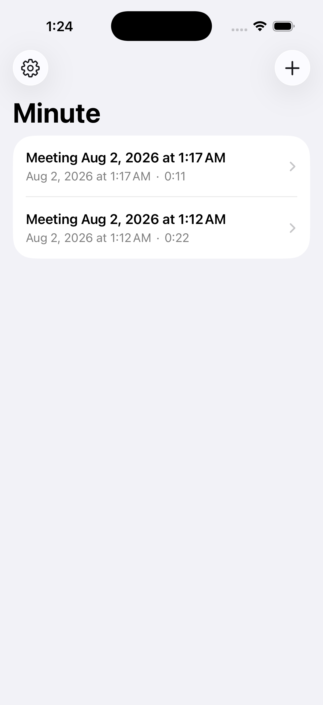
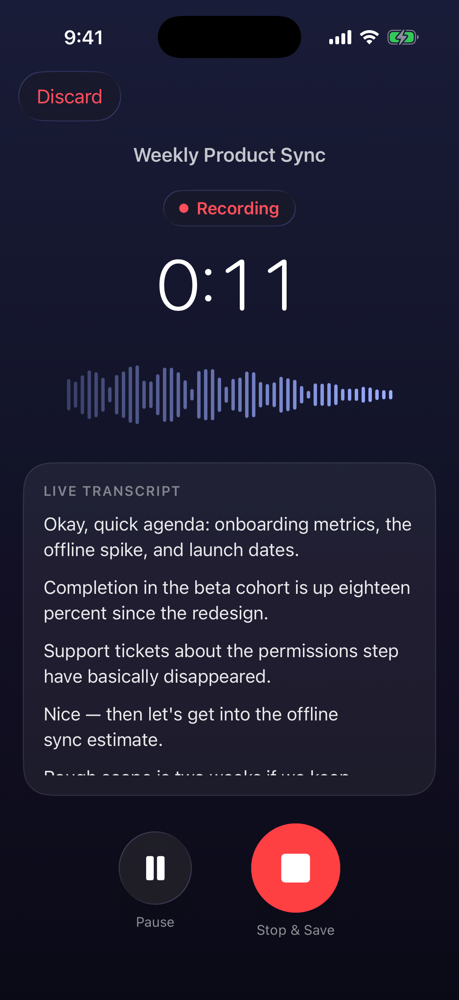
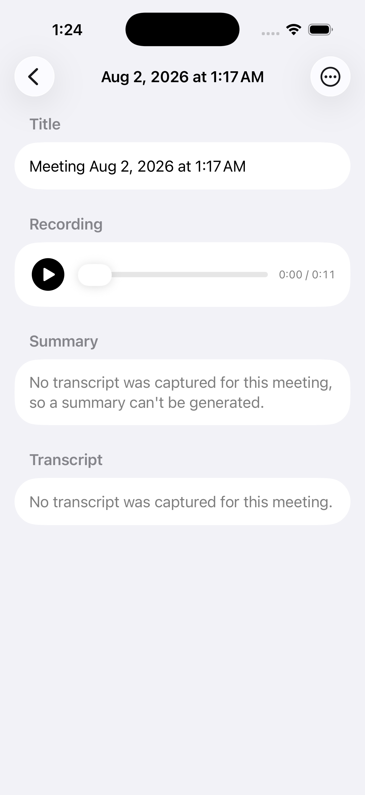
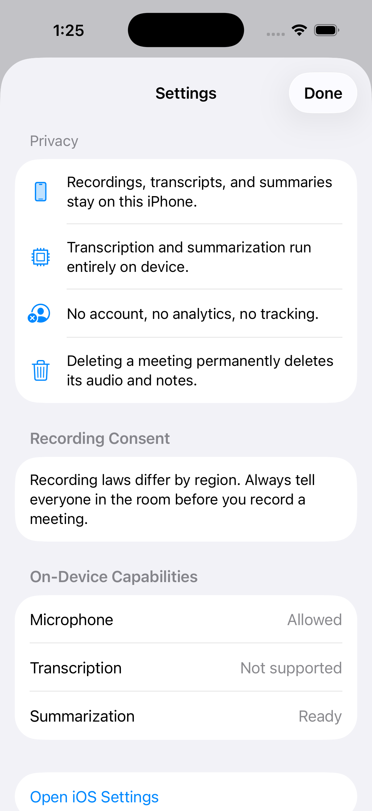

# Minute

**Privacy-first meeting notes for iPhone. Record, transcribe, and summarize — entirely on your device.**


Minute records in-person meetings, produces a live transcript with Apple's on-device speech models, and generates a structured summary (overview, key points, decisions, action items, open questions) with the on-device Apple Intelligence model. **Nothing ever leaves your iPhone** — no account, no backend, no analytics, no tracking.

| Meeting list | Recording | Meeting notes | Settings |
|:---:|:---:|:---:|:---:|
|  |  |  |  |

## Why

Meeting audio is some of the most sensitive data on your phone. Most meeting-notes apps upload it to a server for transcription and summarization. Minute takes the opposite bet: with iOS 26, the phone itself is powerful enough to do all of it locally — so your conversations never need to leave the room.

## Features

- 🎙️ **One-tap recording** with pause/resume, background recording, and graceful handling of phone calls and AirPods switches — on any handled failure (interruption, route change, stop error) the app always offers to save the audio captured so far
- 📝 **Live on-device transcript** while you record (`SpeechAnalyzer`/`SpeechTranscriber`, iOS 26), with timestamped segments — tap a line to jump playback there
- ✨ **On-device AI summary** via Apple's FoundationModels: overview, key points, decisions, action items (owner/deadline are `Not specified` unless actually said — the model is instructed never to invent facts), and open questions
- 📚 **Long-meeting support**: transcripts are chunked, noted per chunk, and merged, staying inside the model's 4,096-token context window — including for dense-token languages like Chinese and Japanese
- ▶️ **Playback** with scrubbing; **edit** the meeting title and summary, **copy / share / delete** everything (transcripts are read-only today)
- 🗑️ **Real deletion**: deleting a meeting deletes its audio file and notes from disk; a startup sweep removes any audio orphaned by a crash
- ♿ System-native UI: light/dark mode, Dynamic Type, VoiceOver labels

## Privacy guarantees

| Guarantee | How |
|---|---|
| Audio, transcripts, summaries stay on device | Stored in the app sandbox (Application Support + SwiftData), excluded from iCloud/computer device backups by default; an opt-in **iCloud Backup** toggle in Settings includes them in the iPhone's own iCloud or computer backup — **no meeting content is ever sent anywhere else** |
| No account, no analytics, no tracking | There is no server, SDK, or telemetry of any kind — grep the source |
| Transcription is local | Apple `SpeechTranscriber` with on-device model assets |
| Summarization is local | Apple `FoundationModels` (Apple Intelligence on-device model) |
| Delete means delete | Removing a meeting removes its `.m4a` and database row; orphaned audio is swept at launch |

> Beyond the opt-in iCloud Backup above, the one network operation in the app's lifetime: when transcription is first prepared, iOS downloads Apple's on-device speech model assets (`AssetInventory`). That is Apple system infrastructure fetching a model — it never includes your recordings, transcripts, or any meeting content.

## Requirements

- **Xcode 26+** (built against the iOS 26.5 SDK), **iOS 26.0+**
- **Live transcription** needs a physical iPhone — `SpeechTranscriber` is unavailable on simulators (the app degrades gracefully and recording still works)
- **Summaries** need an Apple Intelligence–capable iPhone with Apple Intelligence turned on (in the simulator, summaries work if the host Mac has Apple Intelligence enabled)
- No third-party dependencies. None.

## Getting started

```bash
git clone https://github.com/feihou/minute.git
cd minute
open Minute.xcodeproj
```

Select your team under **Signing & Capabilities**, pick your iPhone, and run. The first recording asks for microphone permission and (once) downloads the on-device speech model.

Run the tests:

```bash
xcodebuild -project Minute.xcodeproj -scheme Minute \
  -destination 'platform=iOS Simulator,name=iPhone 17 Pro' test
```

The suite includes a live Apple Intelligence integration test that exercises the real on-device model; it skips itself automatically on machines where the model is unavailable.

## Architecture

Plain SwiftUI + SwiftData with small, single-purpose services — no third-party frameworks:

```
Minute/
├── App/            MinuteApp — SwiftData container (with surfaced fallback)
├── Models/         Meeting (@Model), TranscriptSegment, MeetingSummary
├── Recording/      RecordingSession — orchestrates one recording end to end
├── Services/
│   ├── AudioRecorder           AVAudioEngine → AAC file + live buffer feed
│   ├── TranscriptionService    SpeechAnalyzer/SpeechTranscriber wrapper
│   ├── SummarizationService    FoundationModels + chunk/merge pipeline
│   ├── AudioPlayerController   AVAudioPlayer playback
│   └── MeetingStore            files on disk, delete cascade, orphan sweep
├── Support/        chunker, exporter, buffer conversion, formatting
└── Views/          list, recording, detail, editor, playback, settings
```

The flow: `RecordingSession` starts the recorder immediately (audio capture never waits on anything), then attaches transcription asynchronously once the speech model is ready. On stop, the transcript is finalized and the meeting saved; summaries are generated on demand from the detail screen.

**AI grounding**: the model is *instructed* to use only information present in the transcript and to leave owner/deadline as the literal `"Not specified"` when unstated; post-processing in `SummarizationService` normalizes placeholders and deduplicates, but it cannot fact-check the model's output against the transcript. Like any LLM output, review a summary before acting on it. Output is structured via `@Generable`, not parsed from prose.

## Roadmap / known limitations

Contributions welcome on any of these — see [CONTRIBUTING.md](CONTRIBUTING.md):

- [ ] Speaker awareness in transcripts (diarization) when Apple exposes it
- [ ] Structured per-field editor for action items (currently `task | owner | deadline` lines)
- [ ] Handling of media-services resets during very long recordings (rare; currently pauses safely)
- [ ] Crash recovery for in-progress recordings — today, audio from a recording interrupted by an app crash is removed by the orphan sweep at next launch rather than recovered
- [ ] Localization of the UI (transcription already follows the device locale)
- [ ] Export formats beyond plain text/Markdown (PDF, calendar follow-ups)
- [ ] CI (GitHub Actions with an Xcode 26 runner image)

## Contributing

Bug reports, feature ideas, and PRs are all welcome. Start with [CONTRIBUTING.md](CONTRIBUTING.md) — it covers setup, simulator caveats, testing, and the privacy invariants every change must keep (short version: **no network, no telemetry, everything deletable**).

## License

[MIT](LICENSE)
